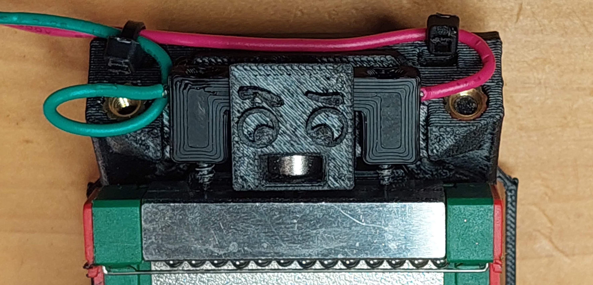
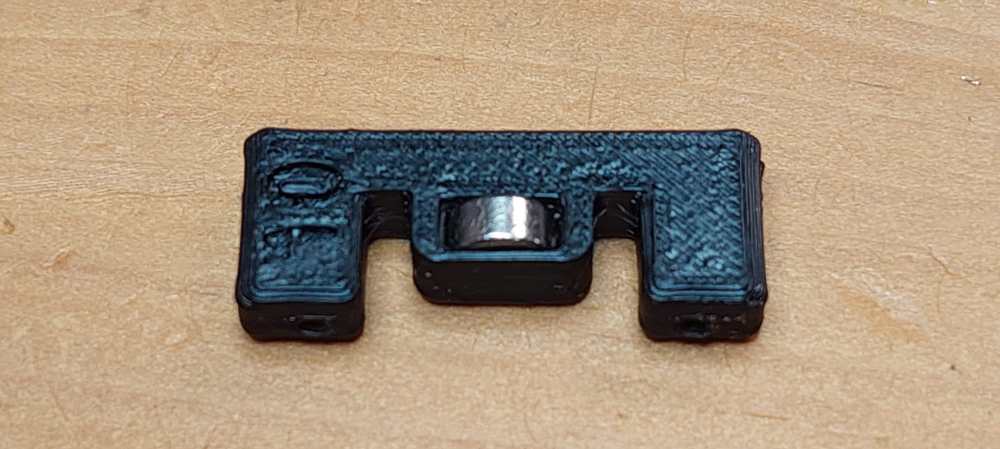
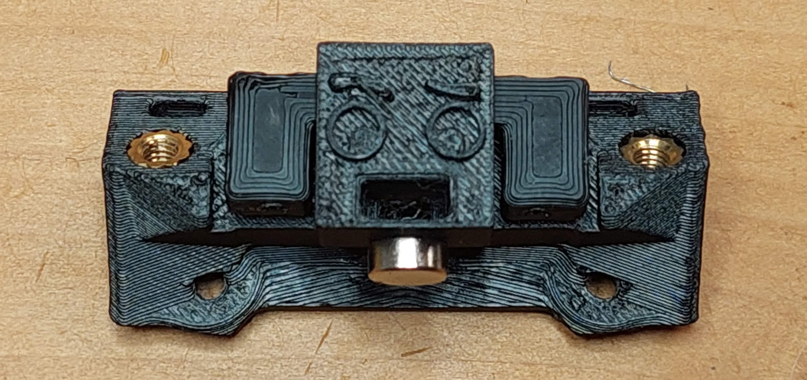
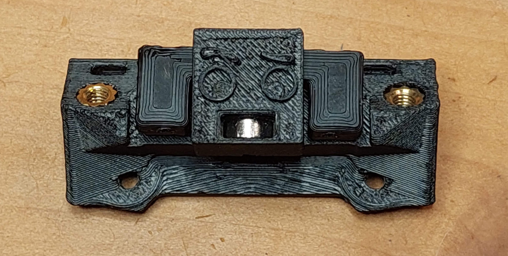
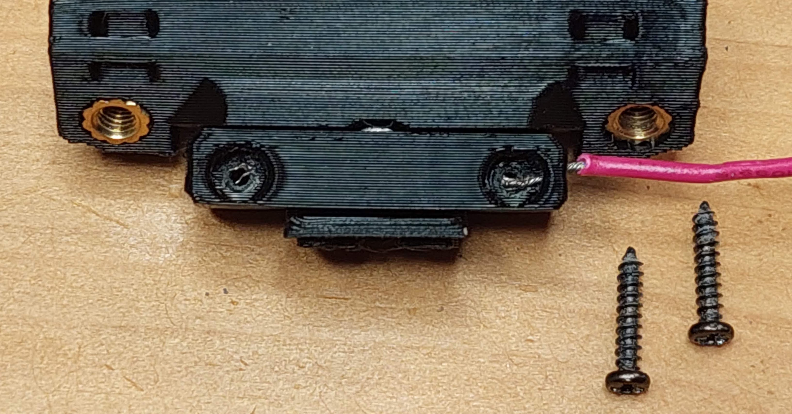

# Unklicky TAP

This is a unklicky sensor for TAP. Thanks to the Voron team for this design and Badnoob for spearheading the effort and lead developer role.

It's almost as precise as the optical sensor, it's main goal is to reduce the initial Voron hug (a lot of people start buying the same obscure part, leaving it out of stock). With that said i can see one using it as a primary sensor as it can achieve a range in probing better than 0.0025 with a standard deviation of 0.001.

**A range of 0.001 is excellent and enough for our 3D printer needs.** don't chase unicorns.

It's pretty easy to install, it does require a somewhat tuned printer.

This version, due to size requirements (needs to fit between TAP and X cable chains), it needs to replace TAP upper parts.

This is functionally  a drop in replacement/spare for the optical PCB for TAP, it uses it's own TAP upper part, but only requires 2 cables, a mcu GND (or V-) and the probe (should use a endstop) signal pin, it does not need a 5v or 24v connection.


|  |
| :---------------------------------------------: |

# How does it work?

The principle behind this sensor, is using the MGN12 steel carriage to make contact with two m2x10 self tapping screws, thereby closing the circuit between the mcu GND (or V-) and the probe (should use a endstop) signal pin.
Two 6x3 magnets makes the pin attract the probe body.

On the image bellow, you can see Unklicky TAP sensor touching the X axis MGN12 carriage.

|  |
| --------------------------------------------------- |

More instructions below:

# What do I need?

## Bom
| Name | Pieces |
| ------ | ------ |
| 6x3mm Magnet | 2 |
|M2x10 self tapping screw| 2 |
|18 to 22 AWG wire| as required |


## Printed parts

| Name | Pieces |
| ------ | ------ |
| Unklicky_TAP_Body_slim.stl | 1|
|Unklicky_TAP_pin_slim_10mm.stl| 1|

### Printing instructions

The parts should be printed with the definitions below, they are oriented ready to print:

* initial layer height:0,24
* layer height: 0.2mm
* bottom/top/perimeters: 4
* infill: more than 30%
* infill type: Cubic
* Thin walls: On

The TAP Body requires supports, but they are included in the model.

## Build

| Instruction | Image |
| ------ | ------ |
|1. Print the parts as they are oriented and remove the body support.|  |
|2. Insert the pin magnet, it should be insert until the it can no longer move. A small part of the magnet will remain outside the slot.|  |
| 3. Rotate the pin and place it on the sensor body, with the magnet opening facing the back.<br />The pin magnet opening is facing the back in the image<br />Attach the other magnet to the outside of the body, and make sure that you respect that orientation when it is inserted on the probe body, both magnets should attract. ||
|4. respecting the polarity, insert the magnet in the sensor body, it should go all the way in, with a bit of force, then stay there. (the groove that holds the magnet was actually designed by Badnoob)||
|5. Slot one of the wires trough the side holes, screw a m2x10 self tapping screw on the hole, making sure it is solidly installed.<br />Repeat this procedure for the other side of the pin.| <br /> |
|6. the sensor is now ready to attach to TAP as it's upper body instead of the Optical PCB sensor + TAP upper part, you can use zip ties to secure both ends of the connectors, just leave room for the pin to move up and down.|  |

## Klipper configuration

Below are the klipper specific unklicky TAP probe configuration, for the rest, please follow the TAP optical probe manual and procedures, they are the same.

```jinja2
[probe]
pin: ^Pin [should enable pullups "^" and use a endstop pin for better effect]
speed: 5
sample_retract_dist: 1.0
samples_tolerance: 0.05
samples_tolerance_retries: 3
```

## Initial run

After initial assembly, don't forget to check your Z probe offset, it will have changed.
**You should also condition the probe with the Klipper command "probe_accuracy samples=1000"** somewhere on top of the bed, it helps getting better results faster.
Speaking of faster, the best results for UnklickyTAP is between 5 and 10mm/s probe speed.

if you decide to use it, give me feedback, either here, or on Voron discord, my discord user is JosAr#0517, feel free to ping me in this channel  [Usermod probes help](https://discord.com/channels/460117602945990666/969563854071799818)

Please feel free to reach out if you have any issues. 


